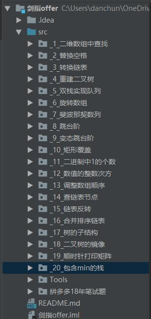

## 剑指offer-Java实现

### 2019/3/17：

##### 23 - 二叉搜索树的后序遍历

> 输入一个整数数组，判断该数组是不是某(二叉搜索树)的后序遍历的结果。
> 如果是则输出Yes,否则输出No。假设输入的数组的任意两个数字都互不相同。

##### 24 - 二叉树中和为某一值得路径

> 输入一颗二叉树的跟节点和一个整数，打印出二叉树中结点值的和为输入整数的所有路径。
> 路径定义为从树的根结点开始往下一直到叶结点所经过的结点形成一条路径。
> (注意: 在返回值的list中，数组长度大的数组靠前)

##### 25 - 复杂链表的复制

> 输入一个复杂链表（每个节点中有节点值，以及两个指针，一个指向下一个节点，另一个特殊指针指向任意一个节点）返回结果为复制后复杂链表的head。（注意，输出结果中请不要返回参数中的节点引用，否则判题程序会直接返回空）

### 项目结构：

### 2019/7/6

在几个月前把剑指offer刷完了，目前为止全部66道题都有。

还有一些在此期间参加的几个厂的笔试题，有些做了有些没做....